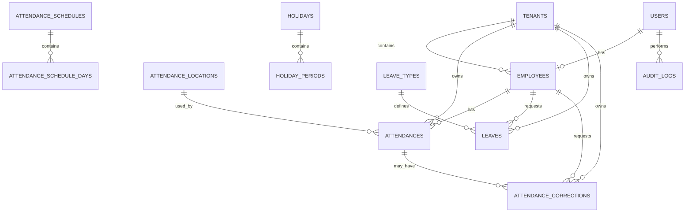

# 03 — DATABASE AND API SPECIFICATION

## Sistem Absensi Tenant MPP Kabupaten Muara Enim

**Version:** 1.0  
**Status:** Approved  
**Depends On:**  
- `01-PRD.md`
- `02-SYSTEM-SPECIFICATION.md`

**Backend:** Laravel 13  
**Frontend:** React + Inertia  
**Database:** MySQL  
**Timezone:** `Asia/Jakarta`

---

# 1. Purpose

Dokumen ini mendefinisikan:

- struktur database,
- entity dan relationship,
- primary key,
- foreign key,
- index,
- unique constraint,
- status,
- data ownership,
- tenant isolation,
- API/route contract,
- request validation,
- response contract,
- authorization requirement.

Dokumen ini menjadi **source of truth untuk data model dan application contract**.

Business rule tidak didefinisikan ulang secara penuh di sini. Aturan bisnis mengacu kepada:

```text
02-SYSTEM-SPECIFICATION.md
```

---

# 2. Database Design Principles

Database harus mengikuti prinsip:

```text
Relational Integrity
Referential Integrity
Tenant Isolation
Auditability
Indexing
Minimal Duplication
Configurable Rules
Safe Deletion
```

Prinsip utama:

> Database harus mencegah data invalid sebanyak mungkin, bukan hanya mengandalkan validasi aplikasi.

---

# 3. Primary Key Strategy

Untuk MVP/production, primary key menggunakan:

```text
BIGINT UNSIGNED
```

Laravel:

```php
$table->id();
```

Alasan:

- native Laravel,
- sederhana,
- efisien untuk MySQL,
- mudah digunakan Eloquent,
- cocok untuk skala aplikasi ini.

External/public identifier dapat ditambahkan kemudian apabila dibutuhkan.

---

# 4. Naming Convention

Gunakan:

```text
snake_case
```

Table:

```text
plural
```

Contoh:

```text
users
tenants
employees
attendances
holidays
```

Foreign key:

```text
tenant_id
employee_id
user_id
```

Timestamp:

```text
created_at
updated_at
```

---

# 5. Core Entity Relationship



---

# 6. Tables Overview

Core tables:

```text
users
tenants
employees

attendance_locations

attendance_schedules
attendance_schedule_days

attendances

holidays
holiday_periods

leave_types
leaves

attendance_corrections

audit_logs
```

Optional/supporting tables:

```text
notifications
password_reset_tokens
sessions
jobs
job_batches
failed_jobs
```

Laravel framework tables dapat mengikuti starter kit dan konfigurasi aplikasi.

---

# 7. Users

Table:

```text
users
```

Purpose:

Menyimpan akun autentikasi.

## Columns

| Column | Type | Null | Key | Description |
|---|---|---:|---|---|
| id | BIGINT UNSIGNED | No | PK | User ID |
| name | VARCHAR(255) | No | | Display name |
| email | VARCHAR(255) | No | UNIQUE | Login email |
| email_verified_at | TIMESTAMP | Yes | | Verification timestamp |
| password | VARCHAR(255) | No | | Password hash |
| remember_token | VARCHAR(100) | Yes | | Laravel auth |
| is_active | BOOLEAN | No | INDEX | User active state |
| created_at | TIMESTAMP | Yes | | |
| updated_at | TIMESTAMP | Yes | | |

Role dan permission tidak disimpan sebagai hard-coded column.

Gunakan authorization system/permission tables.

---

# 8. Tenants

Table:

```text
tenants
```

Purpose:

Menyimpan instansi/organisasi tenant MPP.

## Columns

| Column | Type | Null | Key | Description |
|---|---|---:|---|---|
| id | BIGINT UNSIGNED | No | PK | Tenant ID |
| code | VARCHAR(50) | No | UNIQUE | Tenant code |
| name | VARCHAR(255) | No | INDEX | Tenant name |
| description | TEXT | Yes | | Description |
| phone | VARCHAR(50) | Yes | | Contact |
| email | VARCHAR(255) | Yes | | Contact email |
| address | TEXT | Yes | | Address |
| logo_path | VARCHAR(500) | Yes | | Logo storage path |
| is_active | BOOLEAN | No | INDEX | Active state |
| created_at | TIMESTAMP | Yes | | |
| updated_at | TIMESTAMP | Yes | | |

Recommended:

```text
code = stable business identifier
```

---

# 9. Employees

Table:

```text
employees
```

Purpose:

Menyimpan data petugas yang bekerja pada tenant.

## Columns

| Column | Type | Null | Key | Description |
|---|---|---:|---|---|
| id | BIGINT UNSIGNED | No | PK | Employee ID |
| user_id | BIGINT UNSIGNED | No | FK, UNIQUE | Account |
| tenant_id | BIGINT UNSIGNED | No | FK, INDEX | Tenant owner |
| employee_code | VARCHAR(100) | No | INDEX | Internal employee code |
| name | VARCHAR(255) | No | INDEX | Employee name |
| position | VARCHAR(255) | Yes | | Position |
| phone | VARCHAR(50) | Yes | | Phone |
| email | VARCHAR(255) | Yes | INDEX | Work email |
| is_active | BOOLEAN | No | INDEX | Active state |
| created_at | TIMESTAMP | Yes | | |
| updated_at | TIMESTAMP | Yes | | |

Relationship:

```text
employees.user_id → users.id
employees.tenant_id → tenants.id
```

---

# 10. Employee Constraints

Recommended unique constraint:

```text
UNIQUE(user_id)
```

Untuk employee code:

```text
UNIQUE(tenant_id, employee_code)
```

Dengan demikian tenant berbeda dapat memiliki employee code yang sama, tetapi tenant yang sama tidak boleh memiliki duplicate employee code.

---

# 11. Attendance Locations

Table:

```text
attendance_locations
```

Purpose:

Menyimpan titik lokasi resmi absensi.

Default radius:

```text
20 meters
```

## Columns

| Column | Type | Null | Key | Description |
|---|---|---:|---|---|
| id | BIGINT UNSIGNED | No | PK | Location ID |
| name | VARCHAR(255) | No | | Location name |
| latitude | DECIMAL(10,7) | No | | Latitude |
| longitude | DECIMAL(10,7) | No | | Longitude |
| radius_meter | DECIMAL(8,2) | No | | Allowed radius |
| maximum_gps_accuracy | DECIMAL(8,2) | No | | Max allowed accuracy |
| is_active | BOOLEAN | No | INDEX | Active state |
| created_by | BIGINT UNSIGNED | Yes | FK | User |
| updated_by | BIGINT UNSIGNED | Yes | FK | User |
| created_at | TIMESTAMP | Yes | | |
| updated_at | TIMESTAMP | Yes | | |

---

# 12. Location Rules

Default:

```text
radius_meter = 20.00
maximum_gps_accuracy = 50.00
```

Coordinates harus divalidasi:

```text
latitude >= -90
latitude <= 90

longitude >= -180
longitude <= 180
```

Sistem harus mendukung kemungkinan lebih dari satu location record di masa depan, tetapi MVP dapat menggunakan satu active location utama.

---

# 13. Location Historical Integrity

Perubahan lokasi absensi tidak boleh mengubah data attendance lama.

Contoh:

```text
2026-09-01
Radius = 20m

2026-10-01
Radius = 30m
```

Attendance September tetap mempertahankan:

```text
distance
accuracy
```

yang tersimpan pada saat attendance dilakukan.

Untuk audit configuration history, perubahan location wajib dicatat di audit log.

---

# 14. Attendance Schedules

Table:

```text
attendance_schedules
```

Purpose:

Menyimpan header konfigurasi schedule.

## Columns

| Column | Type | Null | Key | Description |
|---|---|---:|---|---|
| id | BIGINT UNSIGNED | No | PK | Schedule ID |
| name | VARCHAR(255) | No | | Schedule name |
| description | TEXT | Yes | | Description |
| tenant_id | BIGINT UNSIGNED | Yes | FK, INDEX | Optional tenant scope |
| employee_id | BIGINT UNSIGNED | Yes | FK, INDEX | Optional employee scope |
| grace_period_minutes | SMALLINT UNSIGNED | No | | Grace period |
| is_active | BOOLEAN | No | INDEX | Active state |
| created_by | BIGINT UNSIGNED | Yes | FK | Creator |
| updated_by | BIGINT UNSIGNED | Yes | FK | Last updater |
| created_at | TIMESTAMP | Yes | | |
| updated_at | TIMESTAMP | Yes | | |

---

# 15. Schedule Assignment

Schedule dapat memiliki scope:

```text
Global
Tenant
Employee
```

Resolution:

```text
Employee Schedule
      ↓
Tenant Schedule
      ↓
Global Schedule
```

Namun actual resolver harus mengikuti priority yang ditetapkan dalam:

```text
02-SYSTEM-SPECIFICATION.md
```

Jangan membuat priority baru di database layer.

---

# 16. Attendance Schedule Days

Table:

```text
attendance_schedule_days
```

Purpose:

Menyimpan jam kerja setiap hari.

## Columns

| Column | Type | Null | Key | Description |
|---|---|---:|---|---|
| id | BIGINT UNSIGNED | No | PK | ID |
| attendance_schedule_id | BIGINT UNSIGNED | No | FK | Schedule |
| day_of_week | TINYINT UNSIGNED | No | INDEX | 1–7 |
| start_time | TIME | Yes | | Start |
| end_time | TIME | Yes | | End |
| is_working_day | BOOLEAN | No | | Working day |
| created_at | TIMESTAMP | Yes | | |
| updated_at | TIMESTAMP | Yes | | |

Convention:

```text
1 = Monday
2 = Tuesday
3 = Wednesday
4 = Thursday
5 = Friday
6 = Saturday
7 = Sunday
```

---

# 17. Default Schedule Data

Default values:

```text
Monday:
08:00 - 16:00

Tuesday:
08:00 - 16:00

Wednesday:
08:00 - 16:00

Thursday:
08:00 - 16:00

Friday:
07:00 - 16:30

Saturday:
OFF

Sunday:
OFF
```

Values tersebut harus dibuat melalui seeder/configuration, bukan hard-coded dalam attendance controller.

---

# 18. Schedule Constraints

Unique:

```text
UNIQUE(attendance_schedule_id, day_of_week)
```

Validation:

```text
start_time < end_time
```

untuk same-day schedule.

Jika:

```text
is_working_day = false
```

maka:

```text
start_time = NULL
end_time = NULL
```

---

# 19. Holidays

Table:

```text
holidays
```

Purpose:

Menyimpan event hari libur.

## Columns

| Column | Type | Null | Key | Description |
|---|---|---:|---|---|
| id | BIGINT UNSIGNED | No | PK | Holiday ID |
| name | VARCHAR(255) | No | INDEX | Holiday name |
| holiday_type | VARCHAR(50) | No | INDEX | Holiday type |
| start_date | DATE | No | INDEX | Start date |
| end_date | DATE | No | | End date |
| is_full_day | BOOLEAN | No | | Full day flag |
| description | TEXT | Yes | | Description |
| is_active | BOOLEAN | No | INDEX | Active |
| created_by | BIGINT UNSIGNED | Yes | FK | User |
| updated_by | BIGINT UNSIGNED | Yes | FK | User |
| created_at | TIMESTAMP | Yes | | |
| updated_at | TIMESTAMP | Yes | | |

---

# 20. Holiday Types

Default:

```text
NATIONAL_HOLIDAY
JOINT_LEAVE
SPECIAL_HOLIDAY
MPP_CLOSURE
OFFICIAL_EVENT
OTHER
```

Gunakan string/varchar untuk type, bukan database ENUM, agar kategori dapat ditambah tanpa migration.

---

# 21. Holiday Periods

Table:

```text
holiday_periods
```

Purpose:

Menyimpan periode holiday tertentu, terutama untuk partial holiday.

## Columns

| Column | Type | Null | Key | Description |
|---|---|---:|---|---|
| id | BIGINT UNSIGNED | No | PK | Period ID |
| holiday_id | BIGINT UNSIGNED | No | FK, INDEX | Parent holiday |
| holiday_date | DATE | No | INDEX | Applicable date |
| start_time | TIME | Yes | | Start |
| end_time | TIME | Yes | | End |
| is_full_day | BOOLEAN | No | | Full-day period |
| created_at | TIMESTAMP | Yes | | |
| updated_at | TIMESTAMP | Yes | | |

---

# 22. Holiday Period Rules

Untuk full day:

```text
is_full_day = true
start_time = NULL
end_time = NULL
```

Untuk partial:

```text
is_full_day = false

start_time != NULL
end_time != NULL
```

Validation:

```text
start_time < end_time
```

---

# 23. Holiday Period Constraints

Recommended:

```text
UNIQUE(holiday_id, holiday_date, start_time, end_time)
```

Overlapping period pada tanggal yang sama harus dicegah pada application/business layer.

MVP:

> overlapping holiday periods ditolak.

---

# 24. Leaves

Table:

```text
leaves
```

Purpose:

Menyimpan pengajuan izin petugas.

## Columns

| Column | Type | Null | Key | Description |
|---|---|---:|---|---|
| id | BIGINT UNSIGNED | No | PK | Leave ID |
| tenant_id | BIGINT UNSIGNED | No | FK, INDEX | Tenant |
| employee_id | BIGINT UNSIGNED | No | FK, INDEX | Employee |
| leave_type_id | BIGINT UNSIGNED | No | FK | Leave type |
| start_date | DATE | No | INDEX | Start |
| end_date | DATE | No | INDEX | End |
| reason | TEXT | No | | Reason |
| attachment_path | VARCHAR(500) | Yes | | Attachment |
| status | VARCHAR(30) | No | INDEX | Status |
| approved_by | BIGINT UNSIGNED | Yes | FK | Approver |
| approved_at | TIMESTAMP | Yes | | Approval timestamp |
| rejection_reason | TEXT | Yes | | Rejection reason |
| created_at | TIMESTAMP | Yes | | |
| updated_at | TIMESTAMP | Yes | | |

---

# 25. Leave Types

Table:

```text
leave_types
```

## Columns

| Column | Type | Null | Key |
|---|---|---:|---|
| id | BIGINT UNSIGNED | No | PK |
| code | VARCHAR(50) | No | UNIQUE |
| name | VARCHAR(255) | No | |
| description | TEXT | Yes | |
| requires_attachment | BOOLEAN | No | |
| is_active | BOOLEAN | No | INDEX |
| created_at | TIMESTAMP | Yes | |
| updated_at | TIMESTAMP | Yes | |

Example:

```text
SICK
PERSONAL
OFFICIAL_DUTY
OTHER
```

---

# 26. Leave Status

Allowed application values:

```text
PENDING
APPROVED
REJECTED
CANCELLED
```

Use string rather than database ENUM.

---

# 27. Leave Rules

Pending:

```text
does not automatically suppress attendance
```

Approved:

```text
attendance requirement is affected according to leave policy
```

The final status is determined by the attendance engine.

---

# 28. Attendances

Table:

```text
attendances
```

Purpose:

Core attendance record.

## Columns

| Column | Type | Null | Key | Description |
|---|---|---:|---|---|
| id | BIGINT UNSIGNED | No | PK | Attendance ID |
| tenant_id | BIGINT UNSIGNED | No | FK, INDEX | Tenant |
| employee_id | BIGINT UNSIGNED | No | FK, INDEX | Employee |
| attendance_date | DATE | No | INDEX | Date |
| attendance_location_id | BIGINT UNSIGNED | Yes | FK | Location used |
| clock_in | DATETIME | Yes | | Server time |
| clock_out | DATETIME | Yes | | Server time |
| clock_in_latitude | DECIMAL(10,7) | Yes | | GPS |
| clock_in_longitude | DECIMAL(10,7) | Yes | | GPS |
| clock_in_accuracy | DECIMAL(8,2) | Yes | | GPS accuracy |
| clock_in_distance | DECIMAL(8,2) | Yes | | Distance meter |
| clock_out_latitude | DECIMAL(10,7) | Yes | | GPS |
| clock_out_longitude | DECIMAL(10,7) | Yes | | GPS |
| clock_out_accuracy | DECIMAL(8,2) | Yes | | GPS accuracy |
| clock_out_distance | DECIMAL(8,2) | Yes | | Distance meter |
| status | VARCHAR(30) | No | INDEX | Attendance status |
| late_minutes | UNSIGNED INT | No | | Late duration |
| early_leave_minutes | UNSIGNED INT | No | | Early leave |
| work_duration_minutes | UNSIGNED INT | Yes | | Worked duration |
| clock_in_ip | VARCHAR(45) | Yes | | IPv4/IPv6 |
| clock_out_ip | VARCHAR(45) | Yes | | IPv4/IPv6 |
| clock_in_user_agent | VARCHAR(1000) | Yes | | Browser |
| clock_out_user_agent | VARCHAR(1000) | Yes | | Browser |
| notes | TEXT | Yes | | Notes |
| created_at | TIMESTAMP | Yes | | |
| updated_at | TIMESTAMP | Yes | | |

---

# 29. Attendance Status

Allowed:

```text
PRESENT
LATE
ABSENT
LEAVE
HOLIDAY
OFF
```

`PARTIAL_HOLIDAY` is not an attendance status.

It is represented by schedule/holiday periods.

---

# 30. Attendance Unique Constraint

Mandatory:

```text
UNIQUE(employee_id, attendance_date)
```

This is the final duplicate protection.

---

# 31. Tenant Attendance Index

Recommended:

```text
INDEX(tenant_id, attendance_date)
```

Additional:

```text
INDEX(tenant_id, status, attendance_date)
```

This supports dashboard and report queries.

---

# 32. Attendance Location Snapshot

Attendance stores the actual values:

```text
clock_in_latitude
clock_in_longitude
clock_in_accuracy
clock_in_distance
```

and:

```text
clock_out_latitude
clock_out_longitude
clock_out_accuracy
clock_out_distance
```

This means historical attendance does not depend on the current location configuration.

---

# 33. Attendance Corrections

Table:

```text
attendance_corrections
```

Purpose:

Workflow untuk perubahan attendance.

## Columns

| Column | Type | Null | Key |
|---|---|---:|---|
| id | BIGINT UNSIGNED | No | PK |
| tenant_id | BIGINT UNSIGNED | No | FK, INDEX |
| employee_id | BIGINT UNSIGNED | No | FK, INDEX |
| attendance_id | BIGINT UNSIGNED | Yes | FK |
| requested_by | BIGINT UNSIGNED | No | FK |
| correction_type | VARCHAR(50) | No | INDEX |
| requested_clock_in | DATETIME | Yes | |
| requested_clock_out | DATETIME | Yes | |
| reason | TEXT | No | |
| attachment_path | VARCHAR(500) | Yes | |
| status | VARCHAR(30) | No | INDEX |
| reviewed_by | BIGINT UNSIGNED | Yes | FK |
| reviewed_at | TIMESTAMP | Yes | |
| rejection_reason | TEXT | Yes | |
| created_at | TIMESTAMP | Yes | |
| updated_at | TIMESTAMP | Yes | |

---

# 34. Correction Types

Default:

```text
MISSING_CLOCK_IN
MISSING_CLOCK_OUT
WRONG_CLOCK_IN
WRONG_CLOCK_OUT
OTHER
```

---

# 35. Correction Status

```text
PENDING
APPROVED
REJECTED
CANCELLED
```

---

# 36. Correction Snapshot

Approval should preserve:

```text
requested values
original attendance values
reason
requester
approver
approval timestamp
```

Jika diperlukan untuk audit yang lebih kuat, approval event menyimpan before/after state di `audit_logs`.

---

# 37. Audit Logs

Table:

```text
audit_logs
```

Purpose:

Mencatat aktivitas penting.

## Columns

| Column | Type | Null | Key |
|---|---|---:|---|
| id | BIGINT UNSIGNED | No | PK |
| user_id | BIGINT UNSIGNED | Yes | FK, INDEX |
| tenant_id | BIGINT UNSIGNED | Yes | FK, INDEX |
| event | VARCHAR(100) | No | INDEX |
| subject_type | VARCHAR(255) | Yes | INDEX |
| subject_id | BIGINT UNSIGNED | Yes | INDEX |
| old_values | JSON | Yes | |
| new_values | JSON | Yes | |
| metadata | JSON | Yes | |
| ip_address | VARCHAR(45) | Yes | |
| user_agent | VARCHAR(1000) | Yes | |
| created_at | TIMESTAMP | Yes | INDEX |

Audit log secara normal tidak memiliki `updated_at`.

---

# 38. Audit Event Types

Minimum:

```text
LOGIN
LOGOUT

CLOCK_IN
CLOCK_OUT

ATTENDANCE_REJECTED
ATTENDANCE_ATTEMPT_ON_HOLIDAY
ATTENDANCE_ATTEMPT_OUTSIDE_RADIUS
GPS_ACCURACY_FAILED

ATTENDANCE_CORRECTION_CREATED
ATTENDANCE_CORRECTION_APPROVED
ATTENDANCE_CORRECTION_REJECTED

LEAVE_CREATED
LEAVE_APPROVED
LEAVE_REJECTED
LEAVE_CANCELLED

TENANT_CREATED
TENANT_UPDATED
TENANT_DELETED

EMPLOYEE_CREATED
EMPLOYEE_UPDATED
EMPLOYEE_DELETED

LOCATION_CREATED
LOCATION_UPDATED

SCHEDULE_CREATED
SCHEDULE_UPDATED

HOLIDAY_CREATED
HOLIDAY_UPDATED
HOLIDAY_DELETED

PERMISSION_CHANGED
```

---

# 39. Soft Deletes

Soft delete disarankan untuk:

```text
tenants
employees
leave_types
```

Untuk data transaksi:

```text
attendances
leaves
attendance_corrections
```

jangan dihapus secara fisik untuk koreksi administratif biasa.

Attendance sebaiknya immutable/semi-immutable dan berubah melalui workflow correction.

---

# 40. Foreign Key Strategy

Recommended:

```text
employees.tenant_id
→ tenants.id

employees.user_id
→ users.id

attendances.tenant_id
→ tenants.id

attendances.employee_id
→ employees.id

attendances.attendance_location_id
→ attendance_locations.id

holidays...
→ users.id

holiday_periods.holiday_id
→ holidays.id

leaves.employee_id
→ employees.id

leaves.tenant_id
→ tenants.id

attendance_corrections...
→ employees.id
```

Untuk data historis, jangan menggunakan cascade delete yang dapat menghapus transaksi secara tidak sengaja.

---

# 41. Delete Policy

Recommended:

```text
Tenant deletion:
BLOCK if transactional data exists

Employee deletion:
soft delete / deactivate

Attendance deletion:
DISALLOWED for normal admin workflow

Holiday deletion:
soft delete or deactivate

Correction deletion:
DISALLOWED after approval

Audit deletion:
DISALLOWED
```

---

# 42. Data Ownership

## Global

```text
attendance_locations
global schedules
holidays
system settings
```

## Tenant-scoped

```text
employees
attendances
leaves
corrections
tenant schedules
```

## User-scoped

```text
personal profile
personal attendance
personal leave
personal correction
```

---

# 43. Tenant Isolation Rule

Tenant-scoped request harus menentukan tenant melalui authenticated context.

Jangan menerima:

```json
{
    "tenant_id": 99
}
```

sebagai sumber authorization.

Contoh:

```php
$tenantId = auth()->user()->employee->tenant_id;
```

atau melalui tenant context yang ekuivalen.

Jika administrator MPP memiliki global access, tenant filter dapat dipilih berdasarkan permission.

---

# 44. API Architecture

Aplikasi menggunakan:

```text
Laravel 13
+
Inertia
+
React
```

Untuk halaman internal berbasis Inertia, endpoint dapat berupa Laravel web routes.

JSON response tetap dapat digunakan untuk action tertentu seperti:

```text
Clock In
Clock Out
Location validation
```

API versioning hanya diperlukan jika public/external API akan disediakan.

Jika external API belum diperlukan:

```text
/api/v1
```

tidak perlu dipaksakan ke seluruh internal application.

---

# 45. Authentication

Semua protected endpoints membutuhkan authentication.

Concept:

```text
GET /dashboard
POST /attendance/clock-in
POST /attendance/clock-out
```

tanpa authentication:

```text
401 Unauthorized
```

---

# 46. Authorization

Authentication berbeda dari authorization.

Contoh:

```text
Authenticated:
YES

Permission:
clock_in

Tenant:
active

Employee:
active
```

Baru request dapat diproses.

Authorization menggunakan:

```text
Role
Permission
Policy
Tenant Scope
```

---

# 47. Attendance API

## GET `/attendance/today`

Purpose:

Mengambil status attendance user saat ini.

Permission:

```text
authenticated employee
```

Response:

```json
{
    "date": "2026-09-11",
    "schedule": {
        "start": "07:00",
        "end": "16:30"
    },
    "holiday": null,
    "attendance": {
        "clock_in": "2026-09-11T06:58:12+07:00",
        "clock_out": null,
        "status": "PRESENT"
    }
}
```

---

# 48. POST `/attendance/clock-in`

Purpose:

Membuat attendance clock-in.

Request:

```json
{
    "latitude": -3.1234567,
    "longitude": 103.1234567,
    "accuracy": 8.5
}
```

Server harus memperoleh:

```text
user
employee
tenant
server time
```

dari application context.

Client tidak boleh menentukan:

```text
attendance_date
status
late_minutes
distance
```

---

# 49. Clock-In Validation

Backend memvalidasi:

```text
authenticated
user active
employee active
tenant active

effective schedule
holiday state
attendance window

coordinates
GPS accuracy
radius

duplicate attendance
```

Response sukses:

```json
{
    "message": "Clock-in berhasil.",
    "attendance": {
        "id": 123,
        "clock_in": "2026-09-11T06:58:12+07:00",
        "status": "PRESENT",
        "distance": 6.4
    }
}
```

---

# 50. Clock-In Error Response

Example:

```json
{
    "message": "Anda berada di luar area absensi.",
    "code": "OUTSIDE_RADIUS",
    "details": {
        "distance": 37.2,
        "radius": 20
    }
}
```

HTTP:

```text
422 Unprocessable Entity
```

---

# 51. POST `/attendance/clock-out`

Request:

```json
{
    "latitude": -3.1234567,
    "longitude": 103.1234567,
    "accuracy": 7.2
}
```

Backend memperoleh:

```text
server time
employee
tenant
```

sendiri.

Response:

```json
{
    "message": "Clock-out berhasil.",
    "attendance": {
        "id": 123,
        "clock_in": "2026-09-11T06:58:12+07:00",
        "clock_out": "2026-09-11T16:31:14+07:00",
        "status": "PRESENT",
        "work_duration_minutes": 573
    }
}
```

---

# 52. GET `/attendance/history`

Purpose:

Riwayat attendance employee.

Query:

```text
?page=1
&per_page=20
&from=2026-09-01
&to=2026-09-30
&status=PRESENT
```

Authorization:

Employee hanya miliknya.

Admin Tenant:

Tenant sendiri.

Admin MPP:

Sesuai permission.

---

# 53. GET `/attendance`

Purpose:

Monitoring attendance administrative.

Query:

```text
?date=2026-09-11
&tenant_id=10
&status=LATE
&page=1
```

`tenant_id` boleh digunakan hanya apabila authenticated user memiliki permission global yang sesuai.

Admin Tenant tidak boleh menggunakan parameter ini untuk mengakses tenant lain.

---

# 54. Tenant API

## GET `/tenants`

Permission:

```text
view_tenants
```

Admin MPP mendapat daftar tenant yang diizinkan.

Pagination wajib digunakan jika dataset besar.

---

## POST `/tenants`

Permission:

```text
create_tenants
```

Request:

```json
{
    "code": "DPMPTSP",
    "name": "DPMPTSP",
    "description": "..."
}
```

Server menetapkan metadata creator.

---

## PUT `/tenants/{tenant}`

Permission:

```text
update_tenants
```

Policy wajib memverifikasi scope.

---

# 55. Employee API

## GET `/employees`

Scope:

```text
Admin MPP:
all permitted

Admin Tenant:
current tenant

Employee:
self
```

Query:

```text
?search=budi
&status=active
&page=1
```

---

## POST `/employees`

Request:

```json
{
    "name": "Budi",
    "employee_code": "EMP-001",
    "email": "budi@example.com",
    "position": "Petugas Layanan"
}
```

Tenant tidak boleh ditentukan sembarangan oleh Admin Tenant.

---

# 56. Schedule API

## GET `/attendance-schedules`

Permission:

```text
view_schedule
```

## POST `/attendance-schedules`

Permission:

```text
manage_schedule
```

Request:

```json
{
    "name": "Default MPP",
    "grace_period_minutes": 10,
    "days": [
        {
            "day_of_week": 1,
            "start_time": "08:00",
            "end_time": "16:00",
            "is_working_day": true
        },
        {
            "day_of_week": 5,
            "start_time": "07:00",
            "end_time": "16:30",
            "is_working_day": true
        },
        {
            "day_of_week": 6,
            "is_working_day": false
        },
        {
            "day_of_week": 7,
            "is_working_day": false
        }
    ]
}
```

---

# 57. Holiday API

## GET `/holidays`

Filter:

```text
?year=2026
&type=NATIONAL_HOLIDAY
&status=active
```

---

## POST `/holidays`

Full day:

```json
{
    "name": "Hari Kemerdekaan RI",
    "holiday_type": "NATIONAL_HOLIDAY",
    "start_date": "2026-08-17",
    "end_date": "2026-08-17",
    "is_full_day": true,
    "description": "Hari libur nasional"
}
```

---

# 58. Partial Holiday API

Request:

```json
{
    "name": "Kegiatan Internal MPP",
    "holiday_type": "MPP_CLOSURE",
    "start_date": "2026-09-11",
    "end_date": "2026-09-11",
    "is_full_day": false,
    "periods": [
        {
            "holiday_date": "2026-09-11",
            "start_time": "12:00",
            "end_time": "13:30",
            "is_full_day": false
        }
    ]
}
```

Result:

```text
07:00 - 12:00 WORK
12:00 - 13:30 HOLIDAY
13:30 - 16:30 WORK
```

Effective behavior tetap mengikuti `02-SYSTEM-SPECIFICATION.md`.

---

# 59. Leave API

## POST `/leaves`

Request:

```json
{
    "leave_type_id": 2,
    "start_date": "2026-09-14",
    "end_date": "2026-09-15",
    "reason": "Keperluan keluarga"
}
```

Server menetapkan:

```text
employee
tenant
requester
status = PENDING
```

---

# 60. Approve Leave

## POST `/leaves/{leave}/approve`

Permission:

```text
approve_leave
```

Response:

```json
{
    "message": "Pengajuan izin disetujui.",
    "leave": {
        "id": 10,
        "status": "APPROVED",
        "approved_at": "2026-09-11T09:12:00+07:00"
    }
}
```

---

# 61. Reject Leave

## POST `/leaves/{leave}/reject`

Request:

```json
{
    "reason": "Dokumen pendukung belum lengkap."
}
```

Result:

```text
status = REJECTED
```

---

# 62. Correction API

## POST `/attendance-corrections`

Request:

```json
{
    "attendance_id": 123,
    "correction_type": "MISSING_CLOCK_OUT",
    "requested_clock_out": "2026-09-11T16:30:00+07:00",
    "reason": "Lupa melakukan clock-out."
}
```

Server:

```text
requested_by = authenticated user
status = PENDING
```

---

# 63. Approve Correction

## POST `/attendance-corrections/{correction}/approve`

Backend:

```text
validate authorization
validate current status
apply change
write audit
commit transaction
```

Tidak boleh menggunakan update langsung tanpa audit.

---

# 64. Reject Correction

## POST `/attendance-corrections/{correction}/reject`

Request:

```json
{
    "reason": "Bukti pendukung tidak sesuai."
}
```

Result:

```text
status = REJECTED
```

---

# 65. Location API

## GET `/attendance/location`

Purpose:

Mengambil active attendance location untuk UI.

Response:

```json
{
    "name": "MPP Kabupaten Muara Enim",
    "latitude": -3.1234567,
    "longitude": 103.1234567,
    "radius_meter": 20,
    "maximum_gps_accuracy": 50
}
```

Data lokasi yang sensitif terhadap security harus dipertimbangkan sebelum diekspos secara luas.

---

# 66. Location Validation API

Internal/action endpoint dapat menggunakan:

```text
POST /attendance/location/validate
```

Request:

```json
{
    "latitude": -3.1234567,
    "longitude": 103.1234567,
    "accuracy": 8.5
}
```

Response:

```json
{
    "valid": true,
    "distance": 6.42,
    "radius": 20,
    "accuracy": 8.5,
    "maximum_accuracy": 50
}
```

Endpoint ini tidak membuat attendance.

---

# 67. Dashboard API / Data Contract

Dashboard dapat menggunakan Inertia props.

Contoh:

```json
{
    "summary": {
        "total_tenants": 28,
        "total_employees": 146,
        "present": 129,
        "late": 11,
        "leave": 4,
        "absent": 2
    },
    "tenant_summary": []
}
```

Dashboard tidak boleh mengimplementasikan ulang attendance calculation.

Gunakan aggregate/query dari service yang mengacu pada system rules.

---

# 68. Report API

Contoh:

```text
GET /reports/attendance
```

Query:

```text
?from=2026-09-01
&to=2026-09-30
&tenant_id=10
&employee_id=22
&status=LATE
```

Permission:

```text
view_reports
```

Export:

```text
GET /reports/attendance/export
```

dengan permission:

```text
export_reports
```

---

# 69. Pagination

Semua endpoint dengan data koleksi harus menggunakan pagination.

Default:

```text
per_page = 20
```

Maximum:

```text
per_page = 100
```

Frontend boleh meminta jumlah lebih kecil tetapi tidak boleh melewati server-defined maximum.

---

# 70. Filtering

Filter harus divalidasi server.

Contoh:

```text
status
tenant
employee
date range
holiday type
leave status
correction status
```

Tidak boleh menerima arbitrary column sorting/filter tanpa whitelist.

---

# 71. Sorting

Contoh:

```text
?sort=attendance_date
&direction=desc
```

Server hanya menerima kolom yang diizinkan.

Contoh whitelist:

```text
attendance_date
clock_in
clock_out
status
employee_name
tenant_name
```

---

# 72. API Error Contract

Gunakan format konsisten:

```json
{
    "message": "Anda berada di luar area absensi.",
    "code": "OUTSIDE_RADIUS",
    "errors": []
}
```

Untuk validation:

```json
{
    "message": "Data yang diberikan tidak valid.",
    "code": "VALIDATION_ERROR",
    "errors": {
        "accuracy": [
            "The accuracy field is required."
        ]
    }
}
```

---

# 73. HTTP Status Codes

Gunakan:

```text
200 OK
201 Created
204 No Content

400 Bad Request
401 Unauthorized
403 Forbidden
404 Not Found
409 Conflict
422 Unprocessable Entity
429 Too Many Requests

500 Internal Server Error
```

---

# 74. Conflict Responses

Duplicate attendance:

```text
409 Conflict
```

Code:

```text
ALREADY_CLOCKED_IN
```

Contoh:

```json
{
    "message": "Anda sudah melakukan absensi masuk.",
    "code": "ALREADY_CLOCKED_IN"
}
```

---

# 75. Authorization Failure

Jika user mencoba resource tenant lain:

```text
403 Forbidden
```

atau resource dapat diperlakukan sebagai not-found sesuai security policy.

Yang penting:

> Jangan pernah membocorkan bahwa resource tenant lain ada hanya karena ID dapat ditebak.

---

# 76. Request Validation — Coordinates

Latitude:

```text
numeric
between:-90,90
```

Longitude:

```text
numeric
between:-180,180
```

Accuracy:

```text
numeric
>= 0
```

---

# 77. Request Validation — Schedule

```text
day_of_week:
1..7

start_time:
HH:MM

end_time:
HH:MM
```

Working day:

```text
is_working_day = true
```

requires:

```text
start_time
end_time
```

---

# 78. Request Validation — Holiday

```text
start_date <= end_date
```

Full day:

```text
is_full_day = true
```

requires no period time.

Partial:

```text
is_full_day = false
```

requires:

```text
holiday_date
start_time
end_time
```

---

# 79. Request Validation — Leave

```text
start_date <= end_date
leave_type active
reason required
employee active
```

Attachment validation mengikuti requirement security document.

---

# 80. Request Validation — Correction

```text
employee owns attendance
correction status allows action
reason required
requested value valid
```

Correction approval harus menggunakan transaction.

---

# 81. Data Consistency Rules

Database dan application harus sama-sama menjaga:

```text
employee.tenant_id
attendance.tenant_id
leave.tenant_id
correction.tenant_id
```

Tenant ID di attendance harus selalu konsisten dengan employee:

```text
attendance.tenant_id
=
employee.tenant_id
```

Application service harus menetapkannya dari employee context.

---

# 82. Prevent Cross-Tenant Injection

Request seperti:

```json
{
    "employee_id": 999
}
```

tidak boleh langsung diproses hanya karena employee tersebut valid.

Server harus memverifikasi:

```text
employee exists
AND
employee belongs to current tenant scope
```

---

# 83. Transaction Requirements

Operation berikut wajib transactional:

```text
Clock In
Clock Out

Approve Leave
Reject Leave

Approve Correction
Reject Correction

Critical Tenant Change
Critical Employee Change
```

Contoh correction approval:

```text
BEGIN
    validate correction
    update attendance
    update correction
    create audit
COMMIT
```

---

# 84. Attendance Clock-In Transaction

Concept:

```text
BEGIN
    resolve employee
    resolve schedule
    resolve holiday
    validate attendance window
    validate GPS
    validate duplicate
    create attendance
    create audit
COMMIT
```

Jika salah satu gagal:

```text
ROLLBACK
```

---

# 85. Clock-Out Transaction

```text
BEGIN
    load attendance
    verify ownership
    verify clock_in
    verify clock_out absent
    resolve current attendance rule
    validate location
    update clock_out
    calculate duration
    update status if required
    audit
COMMIT
```

---

# 86. API Does Not Own Business Truth

Endpoint hanya menjadi interface.

Business truth berada pada:

```text
Attendance Engine
Schedule Resolver
Holiday Resolver
Location Service
Leave Service
Correction Service
Authorization Policies
```

Controller tidak boleh mengandung seluruh business logic.

---

# 87. Suggested Laravel Components

Recommended:

```text
app/
├── Actions/
│   ├── Attendance/
│   │   ├── ClockIn.php
│   │   └── ClockOut.php
│   ├── Leave/
│   └── Correction/
│
├── DTOs/
├── Models/
├── Policies/
├── Services/
│   ├── Attendance/
│   ├── Schedule/
│   ├── Holiday/
│   ├── Location/
│   ├── Leave/
│   └── Report/
│
└── Http/
    ├── Controllers/
    ├── Requests/
    └── Resources/
```

---

# 88. Suggested Eloquent Relationships

## User

```php
User
    -> employee()
    -> roles()
    -> permissions()
```

## Tenant

```php
Tenant
    -> employees()
    -> attendances()
    -> leaves()
    -> corrections()
```

## Employee

```php
Employee
    -> user()
    -> tenant()
    -> attendances()
    -> leaves()
    -> corrections()
```

## Attendance

```php
Attendance
    -> tenant()
    -> employee()
    -> location()
    -> corrections()
```

---

# 89. Query Scope

Recommended scopes:

```php
Attendance::forTenant($tenantId)

Attendance::forEmployee($employeeId)

Attendance::onDate($date)

Attendance::withStatus($status)
```

Namun tenant isolation tetap harus diperkuat dengan policy/service layer, bukan hanya scope.

---

# 90. Database Index Summary

Minimum:

```text
users.email UNIQUE

tenants.code UNIQUE
tenants.is_active INDEX

employees.user_id UNIQUE
employees.tenant_id INDEX
employees.employee_code INDEX
UNIQUE(tenant_id, employee_code)

attendances.employee_id INDEX
attendances.tenant_id INDEX
attendances.attendance_date INDEX

UNIQUE(employee_id, attendance_date)

INDEX(tenant_id, attendance_date)
INDEX(tenant_id, status, attendance_date)

holidays.start_date INDEX
holidays.end_date INDEX

holiday_periods.holiday_date INDEX

leaves.employee_id INDEX
leaves.tenant_id INDEX
leaves.status INDEX

attendance_corrections.employee_id INDEX
attendance_corrections.status INDEX

audit_logs.user_id INDEX
audit_logs.tenant_id INDEX
audit_logs.event INDEX
audit_logs.created_at INDEX
```

---

# 91. Reporting Considerations

Report besar tidak boleh melakukan:

```text
N+1 query
```

Gunakan:

```text
with()
withCount()
withAggregate()
select()
join()
groupBy()
```

sesuai kebutuhan.

Report bulanan dapat menggunakan aggregate query.

---

# 92. Attendance Reporting Consistency

Dashboard, report, dan export harus menggunakan definisi yang sama untuk:

```text
PRESENT
LATE
ABSENT
LEAVE
HOLIDAY
OFF
```

Jangan membuat:

```text
Dashboard calculation
≠
Report calculation
```

Business calculation harus dipusatkan pada service/query abstraction yang konsisten.

---

# 93. API Security

Semua action endpoint harus:

```text
authenticated
authorized
validated
tenant-scoped
rate-limited when appropriate
audited when required
```

Clock-in dan clock-out harus memiliki rate limit lebih ketat daripada endpoint read-only biasa.

---

# 94. Rate Limiting

Recommended conceptual limit:

```text
Clock In:
limited attempts / minute

Clock Out:
limited attempts / minute

Location validation:
limited requests / minute
```

Nilai final harus disesuaikan setelah load testing dan UX testing.

---

# 95. Sensitive Response Data

Jangan mengirim ke frontend data yang tidak diperlukan.

Contoh attendance response tidak perlu mengembalikan:

```text
password
permission internals
audit metadata
other employee private data
```

Admin report dapat memiliki informasi lebih lengkap sesuai permission.

---

# 96. API Response Principle

Frontend membutuhkan:

```text
state
message
data
code
```

bukan database object mentah.

Gunakan Laravel API Resource/DTO untuk response contract.

---

# 97. Example Attendance Resource

```json
{
    "id": 123,
    "date": "2026-09-11",
    "clock_in": "06:58",
    "clock_out": "16:31",
    "status": "PRESENT",
    "late_minutes": 0,
    "work_duration_minutes": 573,
    "location": {
        "clock_in_distance": 6.4,
        "clock_in_accuracy": 8.0,
        "clock_out_distance": 5.7,
        "clock_out_accuracy": 7.0
    }
}
```

---

# 98. API Contract Stability

Frontend tidak boleh bergantung pada:

```text
database column names
```

secara langsung.

Contoh database:

```text
clock_in_latitude
```

API dapat menggunakan:

```json
{
    "location": {
        "clock_in": {
            "latitude": -3.123
        }
    }
}
```

Dengan demikian perubahan database tidak otomatis memecahkan frontend.

---

# 99. Migration Order

Recommended migration order:

```text
1. users

2. tenants

3. employees

4. attendance_locations

5. attendance_schedules

6. attendance_schedule_days

7. holidays

8. holiday_periods

9. leave_types

10. leaves

11. attendances

12. attendance_corrections

13. audit_logs
```

Authorization/Spatie tables mengikuti package installation/migration masing-masing.

---

# 100. Seed Data

Development/staging harus memiliki seed:

```text
Roles
Permissions

Admin MPP
Admin Tenant
Tenant Staff
Viewer

Default Schedule
Default Leave Types

Sample Tenant
Sample Employee

Sample Attendance Location
```

Default location menggunakan configuration environment/staging, bukan koordinat production yang di-hard-code di source code.

---

# 101. Production Data Rules

Production coordinate MPP harus dimasukkan oleh Admin melalui:

```text
Settings
→ Attendance Location
```

bukan melalui source code.

Default radius:

```text
20m
```

Default GPS accuracy:

```text
50m
```

---

# 102. Data Retention

Attendance dan audit merupakan data historis.

Default policy:

```text
do not auto-delete
```

Retention final mengikuti kebijakan organisasi/administrasi.

Jika retention policy diterapkan di masa depan, penghapusan harus melalui explicit archival policy.

---

# 103. Database Transactions and Audit

Setiap perubahan transaksi penting harus selesai secara atomik:

```text
Business Change
+
Audit Record
```

Tidak boleh:

```text
Attendance updated
Audit failed
```

sementara transaction telah dianggap sukses.

---

# 104. API Acceptance Criteria

## Clock In

Given:

```text
Authenticated employee
Active tenant
Working period
Valid GPS
Distance <= 20m
Accuracy <= configured maximum
No existing attendance
```

Result:

```text
201/200
Attendance created
Audit created
```

---

## Clock In Outside Radius

Given:

```text
Distance > 20m
```

Result:

```text
422
code = OUTSIDE_RADIUS
No attendance record
Audit/security event may be created
```

---

## Clock In Full Holiday

Given:

```text
Full day holiday
```

Result:

```text
422
code = HOLIDAY
No normal attendance record
```

---

## Friday Schedule

Given:

```text
Friday
```

Effective default schedule:

```text
07:00 - 16:30
```

---

## Partial Holiday

Given:

```text
Friday 07:00 - 16:30
Holiday 12:00 - 13:30
```

Result:

```text
Working:
07:00 - 12:00
13:30 - 16:30

Holiday:
12:00 - 13:30
```

---

# 105. API Permission Matrix

| Endpoint/Action | Super Admin | Admin MPP | Admin Tenant | Staff | Viewer |
|---|---:|---:|---:|---:|---:|
| Dashboard | ✓ | ✓ | ✓ | ✓ | ✓ |
| View Tenants | ✓ | ✓ | Limited | - | ✓ |
| Manage Tenants | ✓ | ✓ | - | - | - |
| View Employees | ✓ | ✓ | Own Tenant | Self | - |
| Manage Employees | ✓ | ✓ | Own Tenant | - | - |
| Clock In | ✓* | ✓* | ✓* | ✓ | - |
| Clock Out | ✓* | ✓* | ✓* | ✓ | - |
| View Attendance | ✓ | ✓ | Own Tenant | Self | ✓ |
| Approve Leave | ✓ | ✓ | Own Tenant | - | - |
| Manage Correction | ✓ | ✓ | Own Tenant | Request | - |
| Manage Location | ✓ | ✓ | - | - | - |
| Manage Schedule | ✓ | ✓ | As permitted | - | - |
| Manage Holiday | ✓ | ✓ | - | - | - |
| Reports | ✓ | ✓ | Own Tenant | Own | ✓ |
| Export | ✓ | ✓ | Own Tenant | Own | - |
| Audit Logs | ✓ | ✓ | - | - | - |

`*` hanya jika business policy memberikan permission tersebut.

---

# 106. External API Consideration

MVP tidak membutuhkan public API.

Jika integrasi eksternal diperlukan kemudian:

```text
/api/v1/
```

dapat disediakan dengan:

- API authentication,
- token management,
- rate limiting,
- versioning,
- dedicated Resources,
- audit.

Internal Inertia routes tidak perlu diperlakukan sebagai public API.

---

# 107. Final Data Flow

```text
                    AUTHENTICATED USER
                           │
                           ▼
                    EMPLOYEE CONTEXT
                           │
                           ▼
                     TENANT CONTEXT
                           │
                           ▼
               ┌───────────┴───────────┐
               │                       │
               ▼                       ▼
           SCHEDULE                  HOLIDAY
               │                       │
               └───────────┬───────────┘
                           ▼
                  EFFECTIVE WORK PERIOD
                           │
                           ▼
                    ATTENDANCE ACTION
                           │
              ┌────────────┼────────────┐
              ▼            ▼            ▼
           GPS Rule     Duplicate     Permission
              │            │            │
              └────────────┼────────────┘
                           ▼
                       DATABASE
                           │
                           ▼
                       AUDIT LOG
                           │
                           ▼
                      DASHBOARD
                           │
                           ▼
                        REPORT
```

---

# 108. Final Source of Truth

Data model:

```text
03-DATABASE-AND-API.md
```

Business behavior:

```text
02-SYSTEM-SPECIFICATION.md
```

Product requirement:

```text
01-PRD.md
```

Implementation harus mengikuti ketiga dokumen tersebut.

Urutan authority:

```text
PRD
 ↓
System Specification
 ↓
Database/API Specification
 ↓
Code
```

---

# 109. Definition of Done

Database dianggap siap apabila:

```text
All core tables defined
Foreign keys defined
Indexes defined
Unique constraints defined
Tenant ownership defined
Delete strategy defined
Migration order defined
Seed strategy defined
```

API dianggap siap apabila:

```text
Authentication defined
Authorization defined
Request defined
Validation defined
Response defined
Error code defined
Tenant scope defined
Permission defined
```

---

# 110. Final Core Schema

```text
users
 │
 └── employees
       │
       ├── tenants
       │
       ├── attendances
       │      │
       │      └── attendance_locations
       │
       ├── leaves
       │      │
       │      └── leave_types
       │
       └── attendance_corrections
              │
              └── attendances

attendance_schedules
 │
 └── attendance_schedule_days

holidays
 │
 └── holiday_periods

users
 │
 └── audit_logs
```

---

# 111. Final Rule

Database harus menjaga **integritas data**, sementara application/service layer menjaga **business behavior**.

Dengan demikian:

```text
Database
    =
Data Integrity

Service / Action
    =
Business Logic

Policy
    =
Authorization

Controller / Route
    =
Transport Layer

React / Inertia
    =
User Interface
```

Tidak boleh terjadi:

```text
React
    ↓
menentukan status attendance

React
    ↓
menentukan radius valid

Controller
    ↓
mengandung seluruh attendance engine

Database
    ↓
menerima duplicate attendance
```

Target architecture:

```text
React
  ↓
Laravel Route / Controller
  ↓
Request Validation
  ↓
Policy
  ↓
Action / Service
  ↓
Domain Rules
  ↓
Database Transaction
  ↓
Audit
  ↓
Response
```

---

## End of Specification